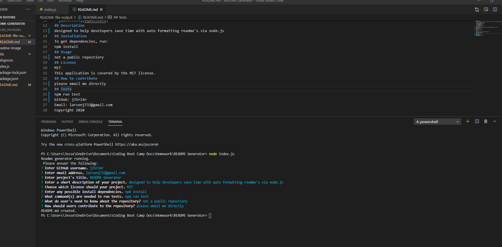

README Generator

## Table of Contents
- [Description](#description)
- [Installation](#installation)
- [Usage](#usage)
- [License](#license)
- [Contributing](#contributing)
- [Tests](#tests)
- [Questions](#questions)
## Description
Designed to help developers save time with auto formatting readme's via node.js
## Installation
To get dependencies, run:
'
npm install
'
## Usage
not a public repository
## License
MIT
This application is covered by the MIT license. 
## How to contribute
if you would like to contribute, please email me!
## Tests
'
npm test
'
GitHub: J35RL4R
Email: larsenj732@gmail.com
Copyright 2020

(made with this application!!)
